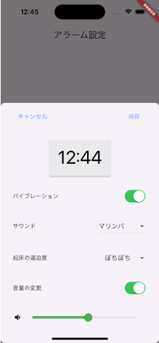

# 眠眠撃々

## 目覚まし時計 × 3D シューティングゲーム

『朝を制するシューティングゲーム』
朝二度寝してしまう全人類に捧げる、絶対に二度寝しない新しい目覚ましアプリ

## 早起きは三種のチョコ

「早起きは三文の徳」とチームメンバー 4 人が大好きな「チョコ」を掛け合わせて生まれたチーム名です。

## 開発にいたった背景・課題・理想の姿

「布団が気持ち良すぎて朝起きられない…」
「一度目が覚めてもつい寝てしまう…」
「ゲームに熱中しすぎてつい夜更かし、朝の起床が辛い…」
誰しもが一度は経験したであろう、二度寝。
スヌーズの音に嫌気がさし、やっとの思いで起きても頭がスッキリしない。朝から憂鬱になってしまうことってありませんか？

「眠眠撃々」は、そんな朝のネガティブな気分をゲームの力でポジティブに払拭できる、今までにない新しい目覚ましアプリです。
この「眠眠撃々」では、目覚ましを止めるためにゲームをクリアする必要があり、プレイするためには身体を起こさなければなりません。

このアプリを通じて、強制的に起き上がることで眠気を吹き飛ばし、快適な起床を提供します。そして、二度寝しないことによって得られる朝の時間を有意義に気持ちよく過ごしてもらいたいです。

## アプリ説明

「眠眠撃々」という名前には、「眠気を撃ち抜く」と「的を撃ち抜く」の２つの意味が込められています。
「眠眠撃々」は、大きく分けて 4 つのフェーズで構成されています。

### 1. アラーム設定

翌朝起床する時間の新規めざましを作成します。

- 起床時刻
- バイブレーションの有無
- サウンド
- 起床の逼迫度
- 音量の変更

が行えます。
サウンドは mp3 ファイルを入れることができるため、好きな音楽で目覚めたり、嫌な音をあえて流したりなど、自由度の高いサウンド設定を実現しています。
起床の逼迫度は「ぼちぼち、可能な限り、絶対に」の３つから選ぶことができ、翌朝の起床すべきレベルに応じてゲームの難易度（的の数）が変更できる仕様となっています。

### 2. アラーム吹鳴とゲーム開始

アラームで指定した時刻になると、アラームが鳴りアプリが起動します。体を起こしたかどうかの確認画面が表示され、「はい」を選択するとゲームがスタートします。
また、アラームが鳴ってからゲームスタートするまでのタイムがカウントアップ計測され、画面に表示されます。

### 3. ３ D シューティングゲーム

アラームを停止するための３ D の的当てシューティングゲームがスタートします。ジャイロ機能によって視点を動かすことができ、画面をタップすることで真ん中のスコープから球を発射します。起床の逼迫度に応じて的の数が変化します。また、ゲームスタートしてからゲームクリアするまでのタイムがカウントアップ計測され、画面上部に表示されます。

### 4. ゲームクリアとアラーム停止

全ての的を撃ち抜くとゲームクリアとなり、アラームが停止します。
クリア画面では、

- アラームが鳴ってからゲーム開始までのタイム
- ゲーム開始からゲームクリアまでのタイム
  の２つが教示されます。

## 特徴・注力した点

「眠眠撃々」の特徴・注力した点を各フェーズごとにまとめます。

### 1. アラーム設定

- 起床時刻の設定をドラムロールで選択できるようにし、ストレスなく使いやすい UI 設計にこだわりました。
- サウンドを自分好みの mp3 ファイルを設定でき、短い音源でも繰り返しアラームが鳴り続けるようにしています。
- 起床の逼迫度に応じてゲームの難易度を選択できるようにし、アプリ利用の習慣化とアラーム停止までの負荷の絶妙なバランスを実現しています。

### 2. アラーム吹鳴とゲーム開始

- アプリを閉じていても通知が画面上部に現れ、アラーム時刻になると自動でアプリが起動される機能を実装しました。
- 体を起こしたかどうかの確認画面で表示される「はい、いいえ」のボタンで、あえて「いいえ」を強調した UI にすることによって、寝ぼけていないか確認するとともにゲームプレイまでのタイム計測により面白味が加わるようにしました。
- 体を起こしたかどうかの確認画面は利用者の状態を確認するのみならず、ゲームスタート時に起き上がっていることでよってゲーム時のジャイロ機能のエラーを最小限にすることができるというシステム側のメリットも同時に実現してます。

### 3. ３ D シューティングゲーム

- この目覚ましアプリは構想当初ゲーム好きで朝が苦手な人向けに考えていました。
- モバイルアプリならではのジャイロ機能を活用することによって、没入感溢れるゲームをプレイすると同時に、実際に体を動かしてプレイすることで眠気が吹き飛び、目覚めの良い朝を迎えられるような体験を実現しています。
- ３ D 空間を認識しやすくするために、多数の直方体をランダムに配置しています。
- ジャイロセンサで取得できる加速度から角度を計算しました。
- プレイしやすいように当たり判定やジャイロ感度などの数値を何度も微調整しました。
- 的同士が重なりすぎないようにランダムに生成できるよう試行錯誤しました。

### 4. ゲームクリアとアラーム停止

- アラームが鳴ってからゲーム開始までのタイムとゲーム開始からゲームクリアまでのタイムの２つを画面表示することで、利用者のモチベーションにつながるようなゲーム性を高めました。
- riverpod を用いて、経過時間とタイマーの状態管理を行えるよう注力しました。

##　使用技術
Flutter

## デモンストレーション動画

<video controls src="画面収録 2025-03-29 11.31.44.mov" title="Title"></video>
<video controls src="画面収録 2025-03-29 11.31.44.mp4" title="Title"></video>
